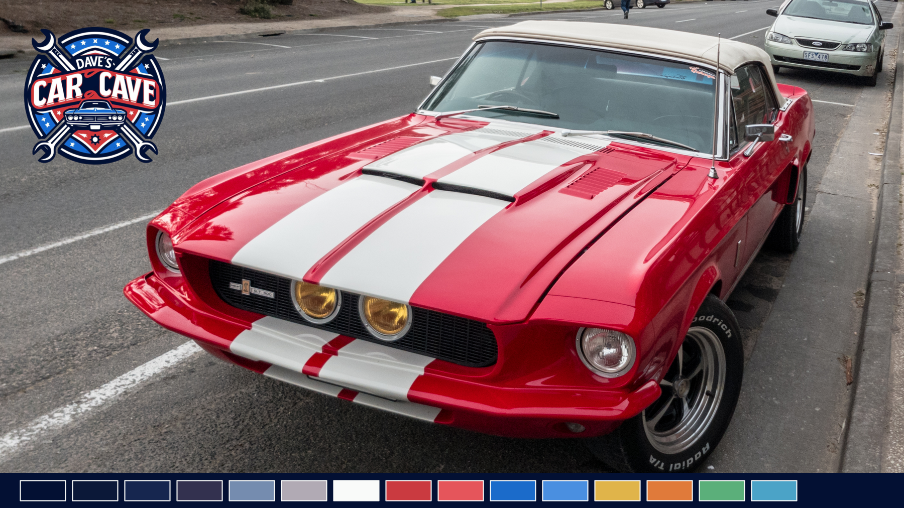
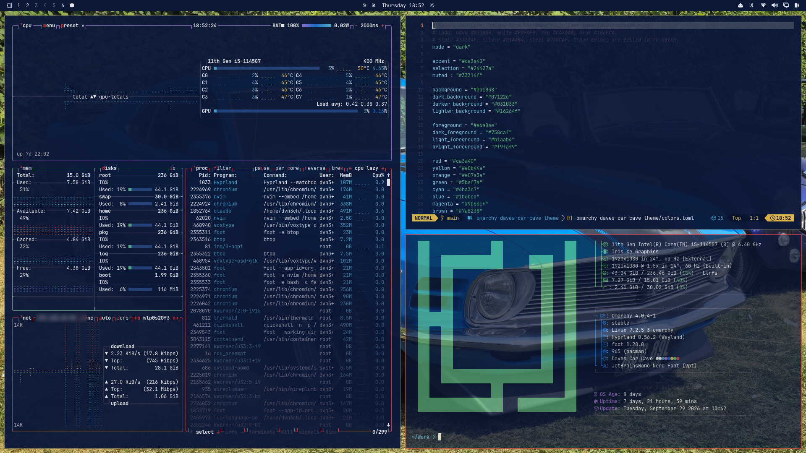

# Dave's Car Cave: an Omarchy theme



A red, white and blue [Omarchy](https://omarchy.org) theme taken from the
[Dave's Car Cave](https://davescarcave.com) logo, with 13 wallpapers of classic
1960s–80s muscle cars and a few legendary exotics.

## Showcase



*btop, Neovim and fastfetch on Omarchy, over the 1970 Mustang Boss 302 wallpaper.*

## Install

```
omarchy theme install https://github.com/dvn3ch/omarchy-daves-car-cave-theme
```

Or use the Omarchy menu: **Install → Style → Theme**, and paste the URL above.

## Palette

| | Color | From |
|---|---|---|
| Background | `#0b1838` | logo navy, lifted for readability |
| Darkest | `#031033` | logo navy |
| Text | `#e6e8ee` / `#f9faf9` | logo white |
| Accent | `#ca3a40` | logo red ("CAR CAVE" banner) |
| Blue | `#1b6bca` | logo blue |
| Muted | `#6b7596` / `#758caf` / `#b1aab4` | logo slate (lifted for contrast), steel, silver |

Yellow, orange, green, cyan and magenta were added to complete the terminal
palette in the same style. Icons use Yaru-red.

## Wallpapers

| | |
|---|---|
| 1968 Dodge Charger | 1970 Dodge Challenger R/T |
| 1970 Dodge Challenger | 1970 Chevrolet Chevelle SS |
| 1969 Chevrolet Camaro Z/28 RS | 1963 Corvette Sting Ray split-window |
| 1967 Shelby Mustang GT500 | 1969 Mustang Boss 302 at Goodwood |
| 1970 Mustang Boss 302 | Ford GT40 (Gulf livery) |
| 1970 Lamborghini Miura P400 S | Ferrari 250 GTO |
| 1987 Porsche 911 Turbo 3.3 | |

Cycle through them with `omarchy theme bg next`.

All photos come from Wikimedia Commons under free licenses. Photographers and
licenses are listed in [CREDITS.md](CREDITS.md).

## License

Theme configuration: MIT. Wallpapers: their own licenses (see CREDITS.md).
Logo: © Dave's Car Cave.
